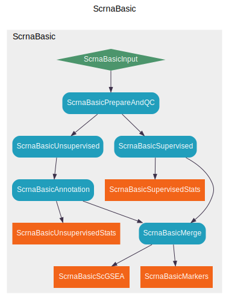

# Basic Analysis of scRNA-seq data

This pipeline is used to process single-cell RNA-seq data with some basic analysis, including:

- Quality control
- Clustering
- Cell type annotation for each cluster
- Mapping to reference cell types
- Marker gene identification
- Gene set enrichment analysis

You may also want to check the processes included in this pipeline in the [processes](#processes) section.

## Installing the pipeline and dependencies

!!! Tip

    If you plan to run the pipeline via `docker`/`singularity`, you can skip this section and go to [Running the pipeline](#running-the-pipeline), and refer to "Via docker/singularity" or "Via `pipen-board` from the container".

### Using `conda`/`mamba`

The pipeline and the dependencies can be installed one by one [manually](#manually). However, we recommend you use `conda`/`mamba` to use the compiled packages, solve potential conflicts, and to separate the dependencies from your system.

- Installing the dependencies

    A set tools and packages are required to run the pipeline. They are listed in <https://github.com/pwwang/biopipen/blob/master/docker/scrna_basic/env.yml>. You can install them with `conda`:

    ```bash
    conda env create -n scrna-basic -f env.yml
    ```

    But we recommend you use [`mamba`](https://anaconda.org/conda-forge/mamba) instead of `conda` to speed up the installation and solve potential conflicts:

    ```bash
    mamba env create -n scrna-basic -f env.yml
    ```

    !!! Remember
        If the dependencies are installed using `conda`/`mamba`, you need to activate the environment before running the pipeline:

        ```bash
        conda activate scrna-basic
        ```

- Installing the pipeline itself

    When the environment is activated, you can install the pipeline with `pip`:

    ```bash
    pip install -U biopipen
    ```

    You may also need to install the frontend dependencies for report generation:

    ```bash
    pipen report update
    ```

### Manually

Again, we recommend you use `conda`/`mamba` to install the dependencies. To install the pipeline itself:

```bash
pip install -U biopipen
```

You may also need to install the frontend dependencies for report generation:

```bash
pipen report update
```

To install the dependencies manually, you can check the environment file <https://github.com/pwwang/biopipen/blob/master/docker/scrna_basic/env.yml> and install them one by one.

## Running the pipeline

The pipeline can be run directly with `pipen` from the command line or via the `pipen-board` plugin, which is a web UI for `pipen` to configure and run pipelines.

- Via the command line:

    ```bash
    pipen run scrna_basic ScrnaBasic [options]
    ```

    To see the brief help, run:

    ```bash
    pipen run scrna_basic ScrnaBasic --help
    ```

    To see the full help, run:

    ```bash
    pipen run scrna_basic ScrnaBasic --help+
    ```

    You can also put the in a file, say `scrna_basic.toml`, and run it:

    ```bash
    pipen run scrna_basic ScrnaBasic @scrna_basic.toml
    ```

    [`TOML`][1] is recommended for the configuration file format. You can also use `YAML` or `JSON`.

- Via the `pipen-board` web UI:

    Start the board:

    ```bash
    pipen board biopipen.ns.scrna_basic:ScrnaBasic -a gh:pwwang/biopipen/board.toml
    ```

    At the UI, configure the pipeline and run it.

- Via docker/singularity:

    ```shell
    docker run \
        --rm \
        # Map current directory to /workdir in the container,
        # and set it as the working directory
        -v .:/workdir -w /workdir \
        biopipen/scrna_basic:master \
        pipen run scrna_basic @ScrnaBasic.config.toml
    ```

    or using singularity:

    ```shell
    singularity run \
        -c -e -w \
        # Map current directory to /workdir in the container,
        # and set it as the working directory
        --pwd /workdir -B .:/workdir \
        docker://biopipen/scrna_basic:master \
        pipen run scrna_basic @ScrnaBasic.config.toml
    ```

- Via `pipen-board` from the container:

    ```shell
    docker run \
        --rm \
        -p 18521:18521 \
        # Map current directory to /workdir in the container,
        # and set it as the working directory
        -v .:/workdir -w /workdir \
        biopipen/scrna_basic:master \
        pipen board biopipen.ns.scrna_basic:ScrnaBasic \
            -a /biopipen/board.toml \
            -s ./.pipen-board
    ```

    or using singularity:

    ```shell
    singularity run \
        -c -e -w \
        # Map current directory to /workdir in the container,
        # and set it as the working directory
        --pwd /workdir -B .:/workdir \
        docker://biopipen/scrna_basic:master \
        pipen board biopipen.ns.scrna_basic:ScrnaBasic \
            -a /biopipen/board.toml \
            -s ./.pipen-board
    ```

    !!! Note
        If you run the pipeline via `pipen-board` from the container, and you want to run it inside
        the same container, you should choose "LOCAL" from the running options to run it.
        Otherwise, you can either choose "DOCKER" or "SINGULARITY" to generate the command and run it
        via the command line.

    !!! Tip
        Other than `master`, there are also other tags for the docker image, which are `dev` and the versions of `biopipen`. They are listed here:

        <https://hub.docker.com/repository/docker/biopipen/scrna-basic/tags?page=1&ordering=last_updated>

        You can use them to run the pipeline with a specific version of `biopipen`.

        Generally, `master` is the latest stable version, `dev` is the latest development version, and the versions of `biopipen` are the stable versions of `biopipen`.

## An example

!!! Tip
    You don't need to prepare the example data if you are running the pipeline via `docker`/`singularity`. The example data are builtin in the docker image at `/example`.

### Preparing the input data

You can run the following command to parepare the input data:

```bash
curl -fsSL \
  https://github.com/pwwang/biopipen/raw/master/docker/scrna_basic/make-examples.sh | \
  bash
```

!!! note
    You should have the dependencies installed before running the above command.

!!! danger
    This will prepare the input data in the current directory, so make sure your current directory is clean.

Files prepared with the above command:

- `KEGG_pathways.gmt`: The gene set file for KEGG pathways, used for `ScrnaBasicScGSEA`.
- `ScTypeDB_full.xlsx`: The cell type database, used for `ScrnaBasicAnnotate` by `ScType` to annotate the cell types if you are using unsuperivsed clustering.
- `data/CTRL`, `data/STIM`: Output of `cellranger`, for the two samples.
  It's from `ifnb` dataset in `SeuratData` package. We separated `CTRL` and `STIM` as two samples for demonstration.
- `example.txt`: The input file for `ScrnaBasic` pipeline. See `infile` below for details.

!!! Note
    Only `unsupervised` clustering is supported for now. If you want to use `supervised` clustering, you need to prepare the cell type reference by yourself.

### Running the pipeline with the example data

A configuration file with the above example input files will be like (suppose the input files are in `/example` directory):

```toml
[plugin_opts]
report_no_collapse_pgs = true

[ScrnaBasic]
clustering = "unsupervised"
# Make sure the RNAData column has the right paths to the data
infile = "/example/example.txt"

[ScrnaBasicAnnotation.envs]
hitype_db = "hitypedb_pbmc3k"

[ScrnaBasicPrepareAndQC.envs]
cell_qc = "nFeature_RNA > 200"

[ScrnaBasicScGSEA.envs]
gmtfile = "/example/KEGG_pathways.gmt"

[ScrnaBasicScGSEA.envs.cases.STIM_vs_CTRL_CD14mono]
filter = "seurat_clusters == 'CD14+ Mono'"
group-by = "Sample"
ident-1 = "STIM"
ident-2 = "CTRL"

[ScrnaBasicScGSEA.plugin_opts]
report_paging = 5
```

Save the above configuration file as `ScrnaBasic.config.toml` in the current directory.

Then run the pipeline:

```bash
pipen run scrna_basic ScrnaBasic @ScrnaBasic.config.toml
```

You can also run the pipeline via `pipen-board`:

```bash
pipen board biopipen.ns.scrna_basic:ScrnaBasic -a gh:pwwang/biopipen/board.toml
```

Then load the above configuration via "From Generated TOML" on the web UI. You may change the configuration if you want. Then run the pipeline via "LOCAL" from the running options on the left sidebar.

### Running the example via docker/singularity

Again, remember that the example data are builtin under `/example` in the docker image, so you don't need to prepare them if you are running the pipeline via `docker`/`singularity`.

```shell
docker run \
    --rm \
    -v .:/workdir -w /workdir \
    biopipen/scrna_basic:master \
    pipen run scrna_basic @ScrnaBasic.config.toml
```

or using singularity:

```shell
singularity run \
    -c -e -w \
    --pwd /workdir -B .:/workdir \
    docker://biopipen/scrna_basic:master \
    pipen run scrna_basic @ScrnaBasic.config.toml
```

You can also run the pipeline via `pipen-board` from the container, and run it inside the container:

```shell
docker run \
    --rm \
    -v .:/workdir -w /workdir \
    biopipen/scrna_basic:master \
    pipen board biopipen.ns.scrna_basic:ScrnaBasic \
        -a /biopipen/board.toml \
        -s ./.pipen-board
```

or using singularity:

```shell
singularity run \
    -c -e -w \
    --pwd /workdir -B .:/workdir \
    docker://biopipen/scrna_basic:master \
    pipen board biopipen.ns.scrna_basic:ScrnaBasic \
        -a /biopipen/board.toml \
        -s ./.pipen-board
```

Then load the above configuration via "From Generated TOML" on the web UI. You may change the configuration if you want. Then run the pipeline via "LOCAL" from the running options on the left sidebar.

!!! Tip

    If you are creating a new instance and run your own data, you probably want to pass an additional configuration to be able to run the pipeline on the web UI. For example, using docker:

    ```shell
    docker run \
        --rm \
        -v .:/workdir -w /workdir \
        biopipen/scrna_basic:master \
        pipen board biopipen.ns.scrna_basic:ScrnaBasic -a /biopipen/board.toml
    ```

    `/biopipen/board.toml` is the configuration file for `pipen-board` in the container. You can find it in the docker image. It only has options to generate command to run the pipeline locally (`LOCAL`, inside the same container in this case, if you run the pipeline via the web UI).

    If you need the command to run the pipeline via docker/singularity, you can use the configuration file `/biopipen/docker/scrna_basic/board.toml` inside the container.

    `pipen board` can also take the configuration file from GitHub, with a format like `gh:owner/repo/path/to/file.toml`. For example, `gh:pwwang/biopipen/board.toml` or `gh:pwwang/biopipen/docker/scrna_basic/board.toml`.

    The default branch is `master`, but you can specify a branch with `gh:owner/repo/path/to/file.toml@branch`.

## Input

The pipeline is actually a single process group `ScrnaBasic`. The arguments for the process group are:

- `clustering`: Which clustering method to use.
    - supervised: Mapping the cells to given reference.
        Using Seurat Reference Mapping procedure.
        See: <https://satijalab.org/seurat/articles/multimodal_reference_mapping.html>
    - unsupervised: Clustering the cells without reference.
        Using Seurat FindClusters procedure.
    - both: Both supervised and unsupervised clustering.
        Performing both of the above procedures. The unsupervised
        clustering will be added as `seurat_clusters_unsupervised`
        to the metadata.
- `infile`: The input file. Either a tab-delimited file containing
    the information of metadata and paths to results of cellranger
    or a seurat object has been saved as RDS file (with extension
    `.rds` or `.RDS`), which QC is assumed to be done.
    As for the tab-delimited file, it should have two columns:
    `Sample` and `RNAData`. `Sample` should be the first column with
    unique identifiers for the samples and `RNAData` indicates where the
    barcodes, genes, expression matrices are.
- `is_seurat`: Whether the input file is a seurat object
    in RDS format.
    If this process group runs independently, this argument should
    not be set. It will be recognized automatically by the extension
    of `infile`. However, if this process group is run as a part of
    a pipeline, this argument should be set manually since `infile`
    should not be set in this case. It will be passed by other processes
- `ref`: The reference file for supervised clustering. It should be an
    RDS file (with extension `.rds` or `.RDS`) containing a seurat
    object, or a h5 file (with extension `.h5` or `.h5seurat`) that
    can be loaded by `Seurat::LoadH5Seurat()`.

## Processes



### `ScrnaBasicInput`

This process simply passes the input file to the next processes.

### `ScrnaBasicPrepareAndQC`

Load, prepare and apply QC to data, using `Seurat`

This process will:
- Prepare the seurat object
- Apply QC to the data

See also:

- <https://satijalab.org/seurat/articles/pbmc3k_tutorial.html#standard-pre-processing-workflow>
- <https://nbisweden.github.io/workshop-scRNAseq/labs/compiled/seurat/seurat_01_qc.html#Create_one_merged_object>

Available environment arguments:

- `ncores`: Number of cores to use.
    Used in `future::plan(strategy = "multicore", workers = <ncores>)`
    to parallelize some Seurat procedures.
- `cell_qc`: Filter expression to filter cells, using
    `tidyrseurat::filter()`.
    Available QC keys include `nFeature_RNA`, `nCount_RNA`,
    `percent.mt`, `percent.ribo`, `percent.hb`, and `percent.plat`
    For example: `nFeature_RNA > 200 & percent.mt < 5` will
    keep cells with more than 200 genes and less than 5%% mitochondrial
    genes.
- `gene_qc`: Filter genes. Currently only `min_cells` is supported.
    `gene_qc` is applied after `cell_qc`.
    - `min_cells`: The minimum number of cells that a gene must be
        expressed in to be kept.

### `ScrnaBasicUnsupervised`

Determine the clusters of cells without reference.
Generally using Seurat FindClusters procedure.

Available environment arguments:

- ncores: Number of cores to use.
    Used in `future::plan(strategy = "multicore", workers = <ncores>)`
    to parallelize some Seurat procedures.
- use_sct (flag;order=-99): Whether use SCTransform routine or not
    If `True`, following procedures will be performed in the order:
    * [`SplitObject`](https://satijalab.org/seurat/reference/splitobject).
    * [`SCTransform*`](https://satijalab.org/seurat/reference/sctransform).
    * [`SelectIntegrationFeatures`](https://satijalab.org/seurat/reference/selectintegrationfeatures).
    * [`PrepSCTIntegration`](https://satijalab.org/seurat/reference/prepsctintegration).
    * [`RunPCA*`](https://satijalab.org/seurat/reference/runpca).
    * [`FindIntegrationAnchors`](https://satijalab.org/seurat/reference/findintegrationanchors).
    * [`IntegrateData`](https://satijalab.org/seurat/reference/integratedata).
    * [`RunPCA`](https://satijalab.org/seurat/reference/runpca).
    * [`RunUMAP`](https://satijalab.org/seurat/reference/runumap).
    * [`FindNeighbors`](https://satijalab.org/seurat/reference/findneighbors).
    * [`FindClusters`](https://satijalab.org/seurat/reference/findclusters).
    * `*`: On each sample
    See <https://satijalab.org/seurat/articles/integration_rpca.html#performing-integration-on-datasets-normalized-with-sctransform-1>.
    If `False`, fast integration will be performed, using reciprocal PCA (RPCA) and
    following procedures will be performed in the order:
    * [`SplitObject`](https://satijalab.org/seurat/reference/splitobject).
    * [`NormalizeData*`](https://satijalab.org/seurat/reference/normalizedata).
    * [`FindVariableFeatures*`](https://satijalab.org/seurat/reference/findvariablefeatures).
    * [`SelectIntegrationFeatures`](https://satijalab.org/seurat/reference/selectintegrationfeatures).
    * [`ScaleData*`](https://satijalab.org/seurat/reference/scaledata).
    * [`RunPCA*`](https://satijalab.org/seurat/reference/runpca).
    * [`FindIntegrationAnchors`](https://satijalab.org/seurat/reference/findintegrationanchors).
    * [`IntegrateData`](https://satijalab.org/seurat/reference/integratedata).
    * [`ScaleData`](https://satijalab.org/seurat/reference/scaledata).
    * [`RunPCA`](https://satijalab.org/seurat/reference/runpca).
    * [`RunUMAP`](https://satijalab.org/seurat/reference/runumap).
    * [`FindNeighbors`](https://satijalab.org/seurat/reference/findneighbors).
    * [`FindClusters`](https://satijalab.org/seurat/reference/findclusters).
    * `*`: On each sample.
    See <https://satijalab.org/seurat/articles/integration_rpca.html>.
- SCTransform (ns): Arguments for [`SCTransform()`](https://satijalab.org/seurat/reference/sctransform).
    `object` is specified internally, and `-` in the key will be replaced with `.`.
    - `<more>`: See <https://satijalab.org/seurat/reference/sctransform>
- SelectIntegrationFeatures (ns): Arguments for [`SelectIntegrationFeatures()`](https://satijalab.org/seurat/reference/selectintegrationfeatures).
    `object.list` is specified internally, and `-` in the key will be replaced with `.`.
    - nfeatures (type=int): The number of features to select
    - `<more>`: See <https://satijalab.org/seurat/reference/selectintegrationfeatures>
- PrepSCTIntegration (ns): Arguments for [`PrepSCTIntegration()`](https://satijalab.org/seurat/reference/prepsctintegration).
    `object.list` and `anchor.features` is specified internally, and `-` in the key will be replaced with `.`.
    - `<more>`: See <https://satijalab.org/seurat/reference/prepsctintegration>
- NormalizeData (ns): Arguments for [`NormalizeData()`](https://satijalab.org/seurat/reference/normalizedata).
    `object` is specified internally, and `-` in the key will be replaced with `.`.
    - `<more>`: See <https://satijalab.org/seurat/reference/normalizedata>
- FindVariableFeatures (ns): Arguments for [`FindVariableFeatures()`](https://satijalab.org/seurat/reference/findvariablefeatures).
    `object` is specified internally, and `-` in the key will be replaced with `.`.
    - `<more>`: See <https://satijalab.org/seurat/reference/findvariablefeatures>
- FindIntegrationAnchors (ns): Arguments for [`FindIntegrationAnchors()`](https://satijalab.org/seurat/reference/findintegrationanchors).
    `object.list` and `anchor.features` is specified internally, and `-` in the key will be replaced with `.`.
    `dims=N` will be expanded to `dims=1:N`; The maximal value of `N` will be the minimum of `N` and the number of columns for each sample.
    Sample names can also be specified in `reference` instead of indices only.
    `reduction` defaults to `rpca`.
    `normalization.method` defaults to `SCT` if `use_sct` is `True`.
    - `<more>`: See <https://satijalab.org/seurat/reference/findintegrationanchors>
- IntegrateData (ns): Arguments for [`IntegrateData()`](https://satijalab.org/seurat/reference/integratedata).
    `anchorset` is specified internally, and `-` in the key will be replaced with `.`.
    `dims=N` will be expanded to `dims=1:N`; The maximal value of `N` will be the minimum of `N` and the number of columns for each sample.
    `normalization.method` defaults to `SCT` if `use_sct` is `True`.
    - `<more>`: See <https://satijalab.org/seurat/reference/integratedata>
- ScaleData (ns): Arguments for [`ScaleData()`](https://satijalab.org/seurat/reference/scaledata).
    `object` and `features` is specified internally, and `-` in the key will be replaced with `.`.
    - verbose (flag): Whether to print the progress
    - `<more>`: See <https://satijalab.org/seurat/reference/scaledata>
- RunPCA (ns): Arguments for [`RunPCA()`](https://satijalab.org/seurat/reference/runpca).
    `object` and `features` is specified internally, and `-` in the key will be replaced with `.`.
    - npcs (type=int): The number of PCs to compute.
        For each sample, `npcs` will be no larger than the number of columns - 1.
    - verbose (flag): Whether to print the progress
    - `<more>`: See <https://satijalab.org/seurat/reference/runpca>
- RunUMAP (ns): Arguments for [`RunUMAP()`](https://satijalab.org/seurat/reference/runumap).
    `object` is specified internally, and `-` in the key will be replaced with `.`.
    `dims=N` will be expanded to `dims=1:N`; The maximal value of `N` will be the minimum of `N` and the number of columns - 1 for each sample.
    - dims (type=int): The number of PCs to use
    - reduction: The reduction to use for UMAP
    - `<more>`: See <https://satijalab.org/seurat/reference/runumap>
- FindNeighbors (ns): Arguments for [`FindNeighbors()`](https://satijalab.org/seurat/reference/findneighbors).
    `object` is specified internally, and `-` in the key will be replaced with `.`.
    - `<more>`: See <https://satijalab.org/seurat/reference/findneighbors>
- FindClusters (ns): Arguments for [`FindClusters()`](https://satijalab.org/seurat/reference/findclusters).
    `object` is specified internally, and `-` in the key will be replaced with `.`.
    - resolution (type=float): The resolution of the clustering
    - `<more>`: See <https://satijalab.org/seurat/reference/findclusters>

### `ScrnaBasicSupervised`

Map the seurat object to reference

See: <https://satijalab.org/seurat/articles/integration_mapping.html>
and <https://satijalab.org/seurat/articles/multimodal_reference_mapping.html>

Available environment arguments:

- use (choice): Which level of cell type to use for further analysis and
    being aliased to `alias`
    - predicted.celltype.l1: The first level of predicted cell type
    - predicted.celltype.l2: The second level of predicted cell type
- alias: The name of an aliasied column to `use`.
    This is helpful for the downstream analysis where the column name
    is used as the cluster.
- ref: The reference seurat object file.
    Either an RDS file or a h5seurat file that can be loaded by
    `Seurat::LoadH5Seurat()`.
    The file type is determined by the extension. `.rds` or `.RDS` for
    RDS file, `.h5seurat` or `.h5` for h5seurat file.
    Defaults to the group argument `ref`
- SCTransform (ns): Arguments for [`SCTransform()`](https://satijalab.org/seurat/reference/sctransform)
    - do-correct-umi (flag): Place corrected UMI matrix in assay counts slot?
    - do-scale (flag): Whether to scale residuals to have unit variance?
    - do-center (flag): Whether to center residuals to have mean zero?
    - `<more>`: See <https://satijalab.org/seurat/reference/sctransform>
        Note that the hyphen (`-`) will be transformed into `.` for the keys.
- FindTransferAnchors (ns): Arguments for [`FindTransferAnchors()`](https://satijalab.org/seurat/reference/findtransferanchors)
    - normalization-method (choice): Name of normalization method used.
        - LogNormalize: Log-normalize the data matrix
        - SCT: Scale data using the SCTransform method
    - reference-reduction: Name of dimensional reduction to use from the reference if running the pcaproject workflow.
        Optionally enables reuse of precomputed reference dimensional reduction.
    - `<more>`: See <https://satijalab.org/seurat/reference/findtransferanchors>.
        Note that the hyphen (`-`) will be transformed into `.` for the keys.
- MapQuery (ns): Arguments for [`MapQuery()`](https://satijalab.org/seurat/reference/mapquery)
    - reference-reduction: Name of reduction to use from the reference for neighbor finding
    - reduction-model: `DimReduc` object that contains the umap model
    - refdata (type=json): Data to transfer
    - `<more>`: See <https://satijalab.org/seurat/reference/mapquery>
        Note that the hyphen (`-`) will be transformed into `.` for the keys.
- MappingScore (ns): Arguments for [`MappingScore()`](https://satijalab.org/seurat/reference/mappingscore)
    - `<more>`: See <https://satijalab.org/seurat/reference/mappingscore>
        Note that the hyphen (`-`) will be transformed into `.` for the keys.

### `ScrnaBasicAnnotation`

Annotate cell types

Either use `scType` or `scCATCH` to annotate cell types, or directly
assign cell types.

Available environment arguments:

- tool (choice): The tool to use for cell type annotation.
    - sctype: Use `scType` to annotate cell types.
        See <https://github.com/IanevskiAleksandr/sc-type>
    - hitype: Use `hitype` to annotate cell types.
        See <https://github.com/pwwang/hitype>
    - sccatch: Use `scCATCH` to annotate cell types.
        See <https://github.com/ZJUFanLab/scCATCH>
    - direct: Directly assign cell types
- sctype_tissue: The tissue to use for `sctype`.
    Avaiable tissues should be the first column (`tissueType`) of
    `sctype_db`.
    Examples are `Immune system`, `Pancreas`, `Liver`, `Eye`, `Kidney`,
    `Brain`, `Lung`, `Adrenal`, `Heart`, `Intestine`, `Muscle`,
    `Placenta`, `Spleen`, `Stomach` and `Thymus`.
- sctype_db: The database to use for sctype.
    Check examples at <https://github.com/IanevskiAleksandr/sc-type/blob/master/ScTypeDB_full.xlsx>
- hitype_tissue: The tissue to use for `hitype`.
    Avaiable tissues should be the first column (`tissueType`) of `hitype_db`.
    If not specified, all rows in `hitype_db` will be used.
- hitype_db: The database to use for hitype.
    Compatible with `sctype_db`.
    See also <https://pwwang.github.io/hitype/articles/prepare-gene-sets.html>
    You can also use built-in databases, including `hitypedb_short`, `hitypedb_full`, and `hitypedb_pbmc3k`.
- cell_types (type=json): The cell types to use for direct annotation
    Each a list of cell type names, or a dict with keys as the old
    identity and values as the new cell type.
- sccatch_args (ns): The arguments for `scCATCH::findmarkergene()` if `tool` is `sccatch`.
    - species (choice): The specie of cells.
        - Human:
        - Mouse:
    - cancer: If the sample is from cancer tissue, then the cancer type may be defined.
    - tissue: Tissue origin of cells must be defined.
    - `<more>`: Other arguments for `scCATCH::findmarkergene()`
        See <https://www.rdocumentation.org/packages/scCATCH/versions/3.2.2/topics/findmarkergene>.
        You can pass an RDS file to `marker` to work as custom marker. If so,
        `if_use_custom_marker` will be set to `TRUE` automatically.

### `ScrnaBasicSupervisedStats`/`ScrnaBasicUnsupervisedStats`

Statistics of the supervised/unsupervised clustering.

Including the number/fraction of cells in each cluster,
the gene expression values and dimension reduction plots.

Available environment arguments:

- stats (type=json): The number/fraction of cells to plot.
    * `nCells_*` - Number of cells for each cluster.
        You can specify `by` to group the cells by a metadata column,
        and `devpars` to specify the device parameters for the plot.
        You can also specify `filter` to filter the cells under certain
        conditions using metadata columns.
    * `fracCells_*` - Fraction of cells for each cluster.
        Similar to `nCells_*`, but the fraction is calculated
        instead of the absolute number.
- exprs (type=json): The expression values to plot.
    * `genes` - The set of genes for the plots, unless `features` for
        those plots is specified. Could also specify a file with genes
        (one per line).
    * `ridgeplots` - The ridge plots for the gene expressions.
        See [`Seurat::RidgePlot`](https://satijalab.org/seurat/reference/ridgeplot).
    * `vlnplots` - Violin plots for the gene expressions.
        See [`Seurat::VlnPlot`](https://satijalab.org/seurat/reference/vlnplot).
        You can have `boxplot` key to add `geom_boxplot()` to the violin plots.
    * `featureplots` - The feature plots for the gene expressions.
        See [`Seurat::FeaturePlot`](https://satijalab.org/seurat/reference/featureplot).
    * `dotplot` - Dot plots for the gene expressions.
        See [`Seurat::DotPlot`](https://satijalab.org/seurat/reference/dotplot).
    * `heatmap` - Heatmap for the gene expressions.
        See [`Seurat::DoHeatmap`](https://satijalab.org/seurat/reference/doheatmap).
        You can specify `average=True` to plot on the average of the expressions.
    * `table` - The table for the gene expressions.
        (supported keys: title, log2, subset and features).
    * All the above can have `devpars` to define the output figures
        and `plus` to add elements to the `ggplot` object.
        You can also have `subset` to subset the data.
        Multiple cases can be distinguished by `ridgeplots` and
        `ridgeplots_1`.
        If no `features` specified, will use `genes`. If you want to use
        the default gene list `VariantFeatures(srtobj)[1:20]`, specify
        `features = "default"`. Or you can also specify the genes
        directly to `features`.
- dimplots (type=json): The dimensional reduction plots.
    * `<case>` - The case to plot.
        Keys are the arguments for `Seurat::Dimplot()`, plus `devpars`
        for the plots. `devpars` is a dictionary with keys `res`,
        `height` and `width` to specify the resolution, height and
        width of the plot. The hyphen (`-`) in the keys will be replaced
        by `.`.

### `ScrnaBasicMerge`:

Merge the supervised and unsupervised clustering results

Add unsupervised clustering as metadata to the seurat object
with supervised clustering.

The unsupervised clustering results are stored in the metadata
`seurat_clusters_unsupervised`.

**Only available when the group argument `clustering` is set to
`both`.**

### `ScrnaBasicMarkers`

Find markers between different groups of cells

When only `group-by` is specified as `"seurat_clusters"` in
`envs.cases`, the markers will be found for all the clusters.

You can also find the differentially expressed genes between
any two groups of cells by setting `group-by` to a different
column name in metadata. Follow `envs.cases` for more details.

If the group argument `clustering` is set to `"both"`,
you can set `group-by` to `"seurat_clusters_unsupervised"` in
a different case to find the markers for the unsupervised clusters.

Available environment arguments:

- ncores: Number of cores to use to parallelize Seurat functions using
    `future::plan(strategy = "multicore", workers = ncores)`
- cases (type=json): The cases to find markers for.
    For example:
    ```json
    {
        "case1": {
            "ident-1": "Tumor",
            "ident-2": "Normal",
            "group-by": "Source",
            # focus on a subset of cells
            "filter": "SampleType != 'Control'"
            # other arguments for Seruat::FindMarkers()
        }
    }
    ```
    We can also use a new `group.by`:
    ```json
    {
        "case2": {
            "ident-1": "Case",
            "ident-2": "Control",
            "group-by": "Group",
            # Do the comparison in each cluster
            "each": "seurat_clusters",
            # other arguments for Seruat::FindMarkers()
            # Filter after mutaters
            "filter2": "SampleType != 'Control'",
            # Use `filer` to filter before mutaters
            "mutaters": {
                "Group" = "if_else(Source %%in%% c('Tumor', 'Normal'), 'Case', 'Control')"
            }
        }
    }
    ```
    If "ident-2" is not provided, it will use the rest of the cells as "ident-2".
    If only "group-by" is given, will call `FindAllMarkers()`.
- dbs (list): The dbs to do enrichment analysis for significant
    markers See below for all librarys.
    <https://maayanlab.cloud/Enrichr/#libraries>
- sigmarkers: An expression passed to `dplyr::filter()` to filter the
    significant markers for enrichment analysis.
    Available variables are `p_val`, `avg_log2FC`, `pct.1`, `pct.2` and
    `p_val_adj`. For example, `"p_val_adj < 0.05 & abs(avg_log2FC) > 1"`

### `ScrnaBasicScGSEA`

Gene set enrichment analysis for cells in different groups using `fgsea`

Available environment arguments:

- ncores: Number of cores to use to parallelize the groups
- cases (type=json): The cases to find markers for.
    `ident-2` is required for each case. One could also use placeholders for the cases.
    To enable this, you need `percluster = True` in the config. Currently only cluster is supported.
    One could use `{cluster}` or `{ident}` to denote the clusters.
    For example:
    ```json
    {
        "case1": {
            # Add a new column in metadata
            "mutaters": { "Group" = "if_else(Response == 'PD1' | Response == 'PD2', 'PD1PD2', Response)" },
            # Only on cluster 0
            "filter": "seurat_clusters == '0'",
            # Groups
            "ident-1" = "CR",
            "ident-2" = "PD1PD2",
            "group-by" = "Group"
        }
    }
    ```
- gmtfile (required): The pathways in GMT format, with the gene names/ids in the same format as the seurat object
- method (choice): The method to do the preranking.
    - signal_to_noise: Signal to noise.
        The larger the differences of the means (scaled by the standard deviations);
        that is, the more distinct the gene expression is in each phenotype and the more the gene
        acts as a "class marker".
    - s2n: Alias of signal_to_noise.
    - abs_signal_to_noise: The absolute value of signal_to_noise.
    - abs_s2n: Alias of abs_signal_to_noise.
    - t_test: T test.
        Uses the difference of means scaled by the standard deviation and number of samples.
    - ratio_of_classes: Also referred to as fold change.
        Uses the ratio of class means to calculate fold change for natural scale data.
    - diff_of_classes: Difference of class means.
        Uses the difference of class means to calculate fold change for nature scale data
    - log2_ratio_of_classes: Log2 ratio of class means.
        Uses the log2 ratio of class means to calculate fold change for natural scale data.
        This is the recommended statistic for calculating fold change for log scale data.
- top (type=auto): Do gsea table and enrich plot for top N pathways.
    If it is < 1, will apply it to `padj`, selecting pathways with `padj` < `top`.
- eps (type=float): This parameter sets the boundary for calculating the p value.
- minSize (type=int): Minimal size of a gene set to test. All pathways below the threshold are excluded.
- maxSize (type=int): Maximal size of a gene set to test. All pathways above the threshold are excluded.
- `<rest>`: Rest arguments for [`fgsea()`](https://rdrr.io/bioc/fgsea/man/fgsea.html)
    See also <https://rdrr.io/bioc/fgsea/man/fgseaMultilevel.html>


[1]: https://toml.io/en/
